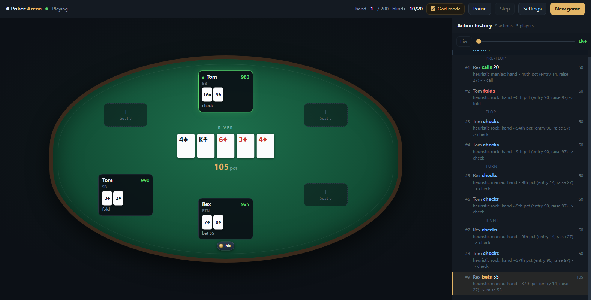

# LLM Poker Arena

Texas Hold'em where every AI opponent is a different *character* played by a
language model.  Seven hand-written personas -- a maths-first grinder, a
hyper-aggressive maniac, an ultra-tight nit, a deceptive trickster, a sticky
calling station, a balanced pro and a ruthless exploiter -- sit at the same
table and try to take each other's chips.

The rules engine is a from-scratch rewrite: correct betting closure, real side
pots, split pots, heads-up blind order, all-in run-outs and strict chip
conservation.



*The browser table: four model-driven seats, the felt with the board and each
player's chips, and a numbered action rail on the right carrying every decision
with the reasoning behind it. God mode is on here, so the hole cards are
readable.*

```
python main.py --demo                    # watch 3 personas play, no API key needed
python main.py --me                      # sit down yourself
python main.py --me --models deepseek-flash   # real models, reasoning visible
python -m pokerarena.web --port 8080     # browser table at http://127.0.0.1:8080
python main.py --models-report           # which models are configured?
```

---

## Why the rewrite

The original code had a working skeleton but the poker itself was wrong in ways
that quietly corrupted games.  Everything below was fixed and is now covered by
tests.

| # | Bug in the original | Consequence | Fix |
|---|---|---|---|
| 1 | `betting_round` reset `current_bet` on the flop but `setup_round` posted blinds **before** the reset on pre-flop | blinds were wiped, so the pot under-counted | blinds are posted after street state is initialised |
| 2 | `raise N` added `N` to the pot but set `current_bet = player.current_bet + N` | raise sizes were wrong, and a raise could fail to raise the price at all | raise amounts are **total street commitments**; the last full raise size drives the minimum |
| 3 | The betting loop only re-checked `active_players` computed once before the loop | a player who called could be skipped, or the loop could spin | action closure: everyone still owing chips or holding an unspent action gets a turn |
| 4 | No minimum-raise tracking | unlimited under-raises | min raise = current bet + last full raise; a sub-minimum **all-in** is still allowed but does not reopen the action |
| 5 | `showdown` picked `best_player` by pairwise comparison and never handled ties | the first player in seat order won split pots | pots split evenly; odd chips go to the first winner clockwise from the button |
| 6 | **No side pots at all** | an all-in player could win (or lose) chips they never matched | layered pots with per-layer eligibility |
| 7 | Uncalled bets were never returned | a shove nobody could call vanished into the pot | uncalled excess is refunded |
| 8 | Pot awarded but `pot` never cleared | the awarded chips were counted again | explicit pot balance, zeroed on award |
| 9 | Heads-up posted blinds the 6-max way | button acted last pre-flop; button posted the big blind | heads-up: button posts the small blind and acts first pre-flop, last post-flop |
| 10 | `rotate_dealer` used stale indices while `remove_broke_players` shrank the list | the button could point at, or skip, the wrong player | seats are stable; busted players are marked `SITTING_OUT`, never removed |
| 11 | `best_hand` / `tiebreaker` had fragile edge cases | Royal Flush was unreachable, `is_straight` compared ints to a string | bitmask evaluator, cross-checked against an independent reference over random hands |
| 12 | `test/test_compare.py` imported `Hand` from `card`, which never had it | the whole test suite failed at collection | evaluator is one module; the old suite now runs against a compatibility shim |
| 13 | AI decisions were injected straight into the game | any illegal model output aborted the hand | a legality firewall: models choose only from the engine-computed legal menu |
| 14 | A crashed/absent model API killed the game | no API key meant no game at all | retry with the rejection reason, then a legal fallback; missing keys degrade to a local bot |

## Architecture

```
pokerarena/
  cards.py       bitmask hand evaluator (5/6/7 cards), Deck, Card
  strength.py    preflop percentiles (Monte-Carlo equity table) + postflop strength
  pot.py         side-pot layering, refunds, tie splitting
  engine.py      Table state machine: blinds, betting, all-ins, showdown  <- the rules
  personas.py    the seven characters: style, voice, aggression, bluff frequency
  ai.py          prompt building, reply parsing, legality firewall, offline bot
  arena.py       game loop, model wiring, hand history
  cli.py         rich terminal table
  web_state.py   threaded game session + JSON snapshots
  web.py         Flask API + browser table
```

The engine is **pure**: it never asks a player what to do.  It exposes
`legal_actions(seat)` and `apply_action(seat, action)`, and raises
`IllegalAction` on anything the rules forbid.  Every decision path -- LLM,
human CLI, browser, offline bot -- goes through that same gate.

### How a persona is different

Personality is not just prompt decoration.  Each persona carries numeric
tendencies that shape a real preflop range, calibrated to genuine poker
frequencies:

| Persona | Style | VPIP | Aggression | Bluff freq |
|---|---|---|---|---|
| Tom | ultra-tight nit | ~45% | 0.30 | 0.04 |
| Alice | maths-first TAG | ~53% | 0.55 | 0.10 |
| Sam | balanced pro | ~63% | 0.65 | 0.30 |
| Max | exploitative | ~61% | 0.80 | 0.40 |
| Zoe | deceptive trickster | ~66% | 0.70 | 0.65 |
| Rex | hyper-aggressive | ~67% | 0.95 | 0.50 |
| Bob | calling station | ~71% | 0.15 | 0.06 |

Measured in a full ring with [`tools/persona_report.py`](tools/persona_report.py)
(`python tools/persona_report.py`):

```
persona           VPIP%   PFR%  preRaise%  postRaise%  fold%  call%  allin%
rock               45.3    3.3        3.0         0.0   59.3   37.7     0.0
calculating        53.3   13.0       11.0         0.0   54.9   34.1     0.3
pro                62.7   20.3       16.3         0.0   49.7   34.0     0.3
shark              61.3   30.3       22.8         0.0   53.9   23.3     1.8
trickster          65.7   24.0       18.3         0.0   49.9   31.8     1.8
maniac             67.0   41.3       31.3         0.0   49.2   19.4    12.6
calling_station    70.7    4.7        3.6         0.0   46.2   50.3     0.0
```

The absolute VPIP is looser than a human full-ring game because these thresholds
are calibrated for unopened pots and then relaxed further whenever the price
justifies continuing; what matters is the *ordering* — a nit that folds 59% of
its decisions versus a maniac that folds 49% and raises 41% of hands.

The LLM also gets a calibrated hand-strength anchor in its prompt, so its
reasoning starts from real hand values rather than vibes:

```
Your hole cards: As Ks -- AK suited (very strong, ~95th percentile)
```

### The legality firewall

The model is given the exact menu of legal actions and must answer in a fixed
format:

```
<action>raise 240</action>
<say>Time to find out where you are.</say>
<thought>He limped twice, so his range is capped. Apply pressure.</thought>
```

If the reply is illegal or unparseable, the exact rejection reason is appended
to the conversation and the model retries.  After the retries are exhausted, a
legal fallback (check, cheap call, or fold) keeps the game moving.  **A model
can never deadlock the game or make an illegal move.**

### Every player has their own private context

Each seat carries an independent, persistent conversation: its own table talk,
its own reasoning, its own actions.  That is what makes a seat behave like a
character with a memory instead of a stateless oracle.

### What a seat is told before it acts

A poker decision is not a function of "my cards and the pot".  Every decision
therefore sends the **whole public picture**, not a summary line:

| Section | Why |
|---|---|
| Position | the button, the blinds, and who is still to act behind you |
| Betting so far this hand | every action in order, street by street, including the blinds |
| The players | stacks, what each has put in this hand, who has folded |
| Effective stacks | what is actually at risk against each opponent, in big blinds |
| SPR | effective stack / pot — the standard commitment measure |
| Recent hands | who won, how big, and what was shown down |
| The legal menu | the exact actions, with their costs |

The **betting history** is the single most important of these.  The old prompt
sent only the current state, so a limped pot and a three-bet pot produced
*identical* prompts — a seat could not tell whether it was facing the first raise
of the hand or the fourth.  The engine now keeps an ordered `Table.hand_log` for
the current hand (blinds included, reset each hand), and the memory records carry
"while you waited: <what the others did>", so a seat can notice an opponent who
has raised three hands running.

This costs roughly 400 tokens per decision instead of 150.  That is a deliberate
trade: the cheaper prompt made the models play like card-strength calculators.

The thread is still structured so a long session stays coherent: the per-turn
records accumulate, and `memory_turns` (default **50**) bounds how many of them
are re-sent.  The full record is always kept, and the Context tab shows all of it.

`GET /api/game/<id>/player/<seat>?context=1` exposes the same data, each entry
tagged with whether it is currently being sent.
`tools/show_prompt.py` prints the exact prompt a seat receives.

### Blind escalation, antes and why games end

Fixed blinds let a short stack fold every hand forever while the others trade a
single big blind back and forth — the game then runs to the hand cap with
several players still holding chips.  Run without a clock, **11 of 12 seeded
games stalled this way.**

Three things fix it, all on by default:

* **Escalating blinds** (`blind_increase_every`, default 15 hands, ×1.5 a level).
* **Antes** from level 2 (`ante_fraction`, default ¼ of the big blind) so folding
  costs something and the pot is always worth contesting.  Antes are dead money:
  they do *not* count toward the street bet, so a player who posted one still
  owes the full big blind.
* **Short-handed range widening** — a range calibrated for six players is far too
  tight three-handed, and a nit waiting for the top 10% simply folds forever.

Escalation deliberately stops once the big blind exceeds the largest remaining
stack: past that point a blind commits everyone and the level carries no
information.  With all of this, **12 of 12 seeded games in every lineup now reach
a single winner**, in a median of 122–153 hands.

## Install

```bash
pip install -r requirements.txt
cp .env.example .env      # fill in whichever API keys you have
```

Python 3.10+.  The engine and the offline bot need **no** third-party packages.

## Usage

### Terminal

```bash
python main.py --demo                                  # 3 personas, offline
python main.py --demo --lineup maniac,rock --delay 0.3 # slow it down to watch
python main.py --me --lineup maniac,rock,trickster     # you vs 3 personas
python main.py --me --lineup shark --models deepseek --chips 2000
python main.py --demo --quiet                          # headless, prints results
python main.py --models-report                         # key status per model
```

Useful flags: `--ais N`, `--chips`, `--small-blind`, `--big-blind`, `--seed`,
`--hands`, `--reveal`, `--no-thoughts`, `--delay`, `--quiet`.

### Web

```bash
python -m pokerarena.web --port 8080     # then open http://127.0.0.1:8080
```

An English-only spectator console: the felt on the left, a **vertical action
rail** on the right. Open `http://127.0.0.1:8080/?session=<id>` to jump straight
to one game.

**Seat the table by clicking it.** There is no setup wizard. Empty chairs show a
dashed `+`; click one and choose *Me (human)*, *AI opponent* (persona + which
provider it plays on), or leave it empty. Two seats minimum, six maximum. The
plan is remembered in the browser, so the next game starts from the same table.
To change a seat mid-game, click the player and use the pencil in its card
header — changes apply to the next game.

**God mode** is the switch in the top bar, and it is one idea with two effects:

* every seat's **hole cards** become visible, and
* every seat's **reasoning** becomes readable (the rail's "why" lines, the
  player card's Context tab, the history thoughts).

It can be flipped at any time while a game runs, and it is a **display-only**
switch: the prompts sent to the models never contain another seat's cards, so
turning it on does not make anyone play better.

What you see with it **off** is exactly what a player at the table would see:

| | Seated at the table | Watching only (no seat) |
|---|---|---|
| your own hand | visible | — |
| everyone else | face down | face down |
| reasoning | private | private |

A pure spectator sees **no** cards at all, because there is no hand that is
theirs. A hand that has already ended is public either way, so a finished hand
always shows what was revealed. The same rule governs the player detail panel,
so it is not a back door.

**Action history** is the right-hand column. Every action carries a **sequence
number** (`#17`) and — in god mode — the reasoning behind it, grouped under
`Hand N` and street markers. Click any row to jump the table to that moment;
click again to return to live. The scrubber at the top of the rail does the same
thing continuously.

**Controls** (top right): `God mode`, `Pause` / `Resume` (`Space`), `Step` to
release exactly one more decision while paused (`→`), `Settings`, `New game`,
and `Esc` to close panels.

**Player cards.** Click any seat during a game to open a floating card; open as
many as you like and drag them anywhere. Three tabs:

* **History** — every decision it has made, tagged with the same sequence number
  as the action rail so you can line up who acted when, plus its reasoning
* **Profile** — the persona brief, voice, and aggression / tightness / bluff bars
* **Context** — the seat's **complete private thread**: the opening prompt plus
  every turn it has ever taken, with the entries currently sent to the model
  highlighted and the rest faded (god mode only)

**When it is your turn**, an action bar appears below the felt:

* `Fold` / `Check` / `Call` / `All in`, coloured by what they do, populated
  straight from the engine's legal-action menu so an illegal move cannot be
  submitted;
* a **raise composer**: type an exact amount, drag the slider (10-chip steps), or
  use the four presets — **½ pot, ¾ pot, pot, all in** — each labelled with the
  amount it will actually produce. A pot-sized raise is computed properly
  (call, then bet the resulting pot), not as a fraction of the current pot.

The composer keeps what you typed or clicked. It used to be re-derived from the
legal window on every 650ms poll, which silently overwrote your choice — that is
why the quick-size buttons appeared not to work.

**Between hands** the table holds the finished hand on screen and shows a result
card: who won, the pot, the final board, and every hand that was shown.

The pause is **scaled by how much there is to read**, so it is never either too
short to follow or a pointless wait:

| Result | Hold |
|---|---|
| everyone folded pre-flop | ~1.1s — just an acknowledgement |
| won without a showdown | ~1.1s |
| two-way showdown on the flop | ~4.9s |
| two-way showdown on the river | ~5.4s |
| three-way showdown on the river | ~6.3s |
| five-way showdown, split pot | ~8.5s |

A card carries a **countdown bar** so the pause is never a mystery, and it can be
dismissed at any time — click it, or press `Space`. The previous hand also stays
in a corner card until the next one is decided, so looking away does not lose it;
click that card to jump the action rail to that hand.

Tune the base with `hand_result_seconds` (default 4.5, **0 disables the pause**).

**Chips** are drawn as a chip badge under their owner's seat box, so a wager is
unambiguously attached to a player rather than floating on the felt. Face-down
cards use a woven card back.

**Eliminated players** leave the felt and move to an **Out** list in the corner,
so a dead seat never competes with the live ones for attention. Click one to open
its card and review what it did.

## Providers and API keys

`Settings → Providers` manages the OpenAI-compatible endpoints this app plays
on. **A fresh install has exactly one** — `deepseek-flash`, with no key — and
everything else is whatever you add. Each one carries its own base URL, model
name and key, and **every provider can be edited or deleted** afterwards.

* Keys are stored in `providers.json`, which is **gitignored**.
* **Nothing reads an API key from the environment.** A provider is
  self-contained, so what the settings list shows is exactly what a seat uses.
* Keys are **never returned by any endpoint** — the API reports only `has_key`.
* Editing with the key field left blank keeps the stored key, so the UI never has
  to echo a secret back to the browser. Use the delete button to drop a key.
* `Test` does a zero-token check against the endpoint's `/models` route.
* A seat whose provider has **no key cannot start a real game**: the request is
  rejected with a clear message rather than silently degrading to local bots.
  Tick *Offline bots only* to play without any API calls.

## Table talk never gives a hand away

A player's `<say>` line is public: every other seat reads it. So it is subject to
one absolute rule — **table talk is never about the actual cards**.

That matters more than it first looks. A truthful line ("two pair, baby!") hands
the other seats a read nobody earned. A *false* one is just as corrosive, because
the model reading it has no way to tell a taunt from a confession, so the whole
channel becomes noise. Both are therefore blocked, and what is left is the part
that actually adds character: taunts, jokes, stalling, complaining about luck,
comments on the pot and the board.

Two layers enforce it:

1. **The system prompt** states the rule in plain terms and lists the forbidden
   categories — hand ranks, card names, plain claims about where you stand, any
   card code — while making clear that taunting, joking and needling are all
   encouraged. Reasoning about cards belongs in `<thought>`, which is private.
2. **`sanitize_speech()`** is the backstop, because a prompt is a request rather
   than a guarantee. Any `<say>` that describes a holding is **dropped** (the
   action and the private reasoning are untouched). Saying nothing is always
   safe; a canned replacement could contradict how the hand was actually played.

The filter catches: all 52 card codes (`Ah`, `10c`); spoken ranks and plurals
("aces", "pocket queens"); possessive claims ("my ace"); named pairs
("seven-deuce", `Q5o`, `AK suited`, `10-4`); hand ranks ("top pair", "the nuts",
"gutshot"); and standing claims ("I'm ahead", "I'm bluffing", "you have me").

It deliberately leaves alone: board talk ("the king on the board scares me"),
pot odds ("I have 3 to 1"), terse pleasantries ("gg", "Good luck"), and reads on
*other* players. `tests/test_table_talk.py` pins down both directions, and a
live `deepseek-flash` run produces lines like *"Wake up, kids! Time to pay the
Rex tax."* with no card information in them.

A model that insists on narrating its hand simply gets that line dropped — one
live run produced an empty `<say>` for a player who tried, while its private
`<thought>` still reasoned about the hand correctly.

## Personas

A persona is what makes a seat feel like a person rather than a solver. It has
two halves:

* **behaviour** — `aggression`, `tightness`, `bluff_frequency`, which drive the
  offline bot directly *and* are described to a model in its system prompt;
* **character** — `name`, `tagline`, `style` (the strategy brief it plays by) and
  `voice` (how it talks, which drives the table talk).

**Seven templates ship with the app** — Alice (calculating), Rex (maniac), Tom
(rock), Zoe (trickster), Bob (calling station), Sam (pro), Max (shark) — and
`Settings → Personas` is where you build your own:

* **Duplicate** any template to get an editable copy. Templates themselves are
  read-only, so a clone can never surprise you by changing.
* **New persona** starts blank, or pick a template from the dropdown to prefill
  every field and then edit it. Writing a name and a system prompt is all that is
  required; the tendencies default to a balanced middle.
* Custom personas are marked **CUSTOM** and can be **edited or deleted** at any
  time. Editing one does not touch the template it came from.

They live in `personas.json`, appear in the seat editor's persona list next to
the templates, and work exactly like a built-in: seat one, give it a provider,
and it plays. Deleting `personas.json` simply removes your custom ones.

```bash
python tools/prune_providers.py --list      # show the stored providers
rm providers.json                           # reset to just the seeded deepseek-flash
rm personas.json                            # drop custom personas, keep the templates
```

The page is a plain Jinja template at `pokerarena/templates/table.html` with no
build step, so you can edit the HTML/CSS/JS and just reload (restart the server,
since Flask caches templates).

### Model configuration

There are two independent paths, on purpose:

| | Used by | Keys from |
|---|---|---|
| `providers.json` | the **web UI** and the offline bot | the key stored with each provider |
| `MODEL_REGISTRY` | the **terminal** UI (`main.py`) and the CLI tools | environment variables |

The terminal keeps the classic env-var flow, so a headless run stays a one-liner:

```bash
python main.py --models-report     # key status per registry entry
```

| Key | Default model | Env var | Notes |
|---|---|---|---|
| `deepseek` | `deepseek-chat` | `DEEPSEEK_API_KEY` | fast, plain chat model |
| `deepseek-flash` | `deepseek-flash` | `DEEPSEEK_API_KEY` | **reasoning model** — see below |
| `deepseek-pro` | `deepseek-v4-pro` | `DEEPSEEK_API_KEY` | reasoning model |
| `ark-deepseek` | `deepseek-v3-250324` | `ARK_API_KEY` | Volcengine Ark |
| `doubao` | `doubao-1-5-pro-32k-250115` | `ARK_API_KEY` | Volcengine Ark |
| `openai` | `gpt-4o` | `OPENAI_API_KEY` | or any OpenAI-compatible relay |
| `claude` | `claude-3-5-sonnet-20241022` | `ANTHROPIC_API_KEY` | Anthropic |

Use one with `--models`, e.g. `python main.py --me --models deepseek-flash`. The
web UI never consults these environment variables — add an endpoint under
`Settings → Providers` instead.

**Reasoning models need a bigger token budget.** `deepseek-flash` emits a hidden
chain-of-thought in `reasoning_content` before it writes any answer. If
`max_tokens` is too small the budget is consumed entirely by thinking and
`content` comes back **empty** with `finish_reason: "length"` — which looks
exactly like a broken model. The seeded provider ships with `max_tokens=4000`
and ticks the *reasoning* box; the arena reports the condition as a clear error
instead of an empty reply. The hidden reasoning is captured and shown as the
AI's "thought" whenever the model omits the `<thought>` tag.

## Tuning knobs

Everything table-related lives in `ArenaConfig` (`pokerarena/config.py`), and the
CLI, the web dialog and the web API all default to the same values:

| Setting | Default | Meaning |
|---|---|---|
| `DEFAULT_MAX_HANDS` | 200 | hands per game before the safety valve stops it |
| `memory_turns` | 50 | previous decisions each seat keeps **in the prompt it sends** |
| `hand_result_seconds` | 4.5 | base pause on the finished hand; scaled by what there is to read (0 disables) |
| `blind_increase_every` | 15 | hands per blind level; `0` disables the clock |
| `blind_increase_factor` | 1.5 | how much each level raises the blinds |
| `ante_fraction` | 0.25 | ante as a fraction of the big blind, from level 2 |
| `llm_retries` | 2 | retries after an illegal/unparseable model reply |

Regenerate the preflop equity table, measure persona behaviour, or verify chip
conservation:

```bash
python tools/gen_preflop_ranking.py   # rebuild the 169-hand equity ordering
python tools/calibrate_ranges.py      # percentile -> VPIP calibration table
python tools/persona_report.py        # measure persona behaviour
python tools/verify_conservation.py   # assert conservation event by event
python tools/llm_smoketest.py --hands 2 --model deepseek-flash   # cheap live check
python tools/shoot.py --players 5     # headless-Chrome screenshot of the UI
```

### As a library

```python
from pokerarena import Card, Deck, evaluate, Table, Player, Action, ActionType

hole = [Card.from_str("As"), Card.from_str("Ks")]
board = [Card.from_str(c) for c in ("Qs", "Js", "Ts", "2d", "3c")]
print(evaluate(hole + board).name)     # Royal Flush

players = [Player(name=f"P{i}", seat=i, chips=1000) for i in range(4)]
table = Table(players, small_blind=10, big_blind=20, seed=42)
table.start_hand()
while not table.is_hand_over:
    seat = table.actor
    legal = table.legal_actions(seat)
    action = Action(ActionType.CHECK if legal.can_check else ActionType.CALL)
    table.apply_action(seat, action)
print(table.showdown_results)
```

## Tests

```bash
python -m pytest                       # 500+ tests, <2s, no network
python -m pytest tests/test_engine.py  # the rules
python -m pytest tests/test_pot.py     # side pots
python -m pytest tests/test_ai.py      # the legality firewall
python -m pytest tests/test_web.py     # the API
```

Coverage highlights:

* **Evaluator** -- every category and tiebreaker, plus a brute-force cross-check
  against an independent reference implementation over 40 seeds of random hands.
* **Pots** -- side-pot layering, tie splits, odd-chip distribution, uncalled-bet
  refunds, and property tests proving chips are neither created nor destroyed.
* **Engine** -- heads-up blind order, the big blind's option, full raises
  reopening the action, short all-ins *not* reopening it, all-in run-outs,
  button rotation past busted players, and end-to-end side-pot awards.
* **Chip conservation** -- 300 random hands and full games checked hand-by-hand,
  and a `tools/verify_conservation.py` sweep that asserts the invariant after
  *every individual event* across 25 complete games.
* **LLM layer** -- reply parsing variants, illegal-action retry, transport
  failure, fallback legality from arbitrary states, prompt never leaking
  opponent hole cards.
* **Web** -- input validation, snapshot hygiene (no API keys), turn guards.

## Development tools

```bash
python tools/gen_preflop_ranking.py   # regenerate the equity percentile table
python tools/calibrate_ranges.py      # percentile -> VPIP calibration table
python tools/persona_report.py        # measure persona behaviour in a full ring
python tools/verify_conservation.py   # assert chip conservation event by event
python tools/llm_smoketest.py         # play N hands against a real model, print reasoning
python tools/memory_check.py          # verify per-seat context survives across hands
python tools/shoot.py                 # quick headless-Chrome screenshot
python tools/cdp.py                   # drive/inspect the live page over DevTools Protocol
```

`tools/cdp.py` is how the web UI was verified — it launches Chrome with remote
debugging so you can assert on *rendered* state rather than the served HTML:

```bash
python tools/cdp.py eval "document.querySelectorAll('.seat').length"
python tools/cdp.py errors                      # console errors / JS exceptions
python tools/cdp.py script --file check.js      # run a script in the page
python tools/cdp.py shot ui.png --wait 6
```

`strength.py` contains a generated table of all 169 starting hands ordered by
Monte-Carlo all-in equity against a random opponent.  It is committed, so
imports are free; regenerate it only if you want different sample counts.

## Adding a persona

```python
# pokerarena/personas.py
PERSONAS["loose_aggressive"] = Persona(
    key="loose_aggressive",
    name="Ember",
    tagline="raises first, thinks later",
    style="...",       # strategic brief for the model
    voice="...",       # how they talk at the table
    aggression=0.85,   # -> raise frequency and sizing
    tightness=0.25,    # -> VPIP: target_vpip = 1 - tightness
    bluff_frequency=0.45,
    temperature=1.0,
)
```

`tightness` maps onto a measured percentile threshold, so `1 - tightness` is a
real VPIP target.  Run `tools/persona_report.py` to confirm the range.

## Notes and limitations

* **No rake, no straddle, no rebuys.**  Once you are out of chips you are out.
  Blinds and antes escalate on a clock (see above); set
  `blind_increase_every=0` for fixed blinds.
* **Tournament-style elimination only.**  Cash-game table changes (players
  joining/leaving mid-game) are not modelled.
* **`max_hands` is a safety valve**, not a rule (default 200, one source of
  truth shared by the CLI, the web dialog and the web API).  With escalation on
  it is rarely reached; if it is, the game stops and reports the chip leader.
* **LLM seats are slow and cost money.**  Each decision is one API call, and a
  full game is hundreds of calls.  Use `--demo` or the offline brains to iterate
  on everything except model behaviour; use `tools/llm_smoketest.py --hands 2`
  for a cheap live check.  Reasoning models are slower again (roughly 4-5s per
  decision for `deepseek-flash`).
* **The web table seats at most six players.**  That is a layout constraint, not
  a rules one: six seat boxes is the most that fits the felt without overlapping.
  The engine itself handles more.  Keep the AI pacing at ~0.5s or higher so you
  can follow a game; `0` makes it finish instantly.
* **Several games can exist at once.**  `New game` starts another session; the
  browser follows the newest, and `?session=<id>` opens a specific one.  Older
  sessions stay in memory until the manager's cap evicts them.
* **Localhost and a system proxy.**  If you run a proxy (Clash, Fiddler) that
  also intercepts loopback traffic, set `NO_PROXY=127.0.0.1,localhost` before
  starting the server, or a self-hosted provider on `127.0.0.1` will return 502.
* The web server binds to `127.0.0.1` by default and has no authentication --
  it is a local development/demo tool, not a public service.

## License

No license file was included with the original project; add one before
distributing.
