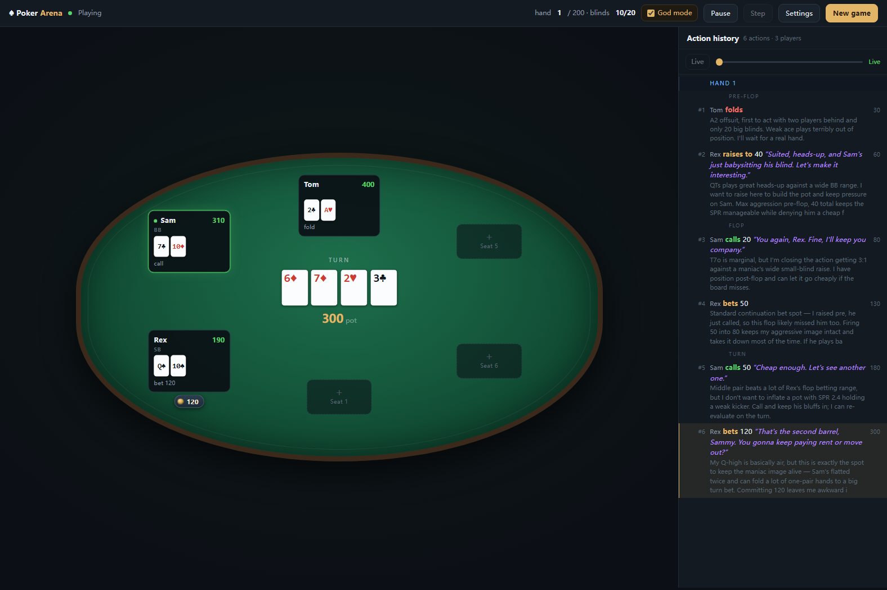

# LLM Poker Arena

[](LICENSE)
[](https://www.python.org/downloads/)
[](#tests)

Texas Hold'em where every seat at the table is a different AI opponent with its
own personality — played by whatever language model you point it at.

Seven characters ship with it: a maths-first grinder, a hyper-aggressive maniac,
an ultra-tight nit, a deceptive trickster, a sticky calling station, a balanced
pro and a ruthless exploiter. Same cards for everyone; the personalities are what
you are actually watching.



> **New here?** <https://jiale-wangOwO.github.io/LLM-Poker-Arena/> is a product
> tour with screenshots. This file is the technical documentation.

---

## Let your agent set it up

If you have a coding agent (Claude Code, Cursor, Copilot, Codex, whatever), you
don't need to read the rest of this file. Just say to it:

```text
Hi! Please install https://github.com/jiale-wangOwO/LLM-Poker-Arena for me and
get it running.

When it's ready, give me a short list of how to use it.
```

Everything it needs is below, so it can read the instructions itself.

You do not need an API key to get this far: the table deals and plays itself with
built-in opponents. Add a key when you want real models at the table.

---

## Requirements

* **Python 3.10 or newer.** Check with `python --version`.
* **pip**, and ideally a virtual environment so nothing leaks into your system
  Python.
* **An API key** for at least one OpenAI-compatible endpoint — *optional to start*.
  Any hosted provider works, and so does a local server (Ollama, LM Studio,
  vLLM) since they all speak the same API.

Nothing else. No database, no Node, no Docker, no build step.

## Installation

```bash
git clone https://github.com/jiale-wangOwO/LLM-Poker-Arena.git
cd LLM-Poker-Arena
```

Create and activate a virtual environment:

```bash
# macOS / Linux
python3 -m venv .venv
source .venv/bin/activate

# Windows (PowerShell)
python -m venv .venv
.venv\Scripts\Activate.ps1
```

Install the dependencies:

```bash
pip install -r requirements.txt
```

Four packages: the OpenAI client, Flask for the web table, `rich` for the
terminal view, and pytest. The poker engine itself uses only the standard
library.

Confirm it works:

```bash
python -m pytest
```

## Start the table

```bash
python -m pokerarena.web --port 8080
```

Open **<http://127.0.0.1:8080>**.

There is no setup wizard. Empty chairs on the felt are clickable: click one,
choose **AI** or **You**, pick a character, and press save. Then press
**New game**.

To seat yourself, use one human seat and fill the rest with characters. To watch,
make them all AI.

### Adding your model

Open **Settings → Providers**. A fresh install has one entry, `deepseek-flash`,
with no key. Fill in:

| Field | Example |
|---|---|
| Base URL | `https://api.deepseek.com/v1` |
| Model | `deepseek-flash` |
| API key | your key |

Press **Test** to check the endpoint, then save. Keys are stored on your own
machine in `providers.json` (gitignored) and are never sent back to the browser.

Any OpenAI-compatible endpoint works. For a local model, point the base URL at it
— for example `http://127.0.0.1:11434/v1` for Ollama.

You can add several providers and give each seat a different one, which is a
quick way to compare two models on identical cards.

### Running several games

**New game** starts another session; the browser follows the newest. Open
`http://127.0.0.1:8080/?session=<id>` to return to a specific one.

## Playing in the terminal instead

```bash
python main.py --me --lineup maniac,rock,trickster                 # you and three characters
python main.py --me --lineup shark --models deepseek-flash --chips 2000
python main.py --models-report                                     # key status per model
python main.py --help                                              # all options
```

The terminal reads keys from a `.env` file rather than `providers.json`:

```bash
cp .env.example .env      # then fill in whichever keys you have
```

`--lineup` takes persona keys: `calculating`, `maniac`, `rock`, `trickster`,
`calling_station`, `pro`, `shark`. `--models` takes registry keys: `deepseek`,
`deepseek-flash`, `deepseek-pro`, `ark-deepseek`, `doubao`, `openai`, `claude`.

> You can also run `python main.py --demo` for a zero-setup preview of the table.
> That mode skips the models entirely and uses built-in opponents, so nobody is
> really thinking — it is only useful for a quick look at the interface.

## How it fits together

```text
pokerarena/
  cards.py      bitmask 5/6/7-card evaluator, deck, card
  engine.py     betting closure, side pots, street flow, table state
  pot.py        pot layering, refunds, split payouts
  strength.py   hand ranking, and equity against a range

  personas.py   the seven characters: style, voice, tendencies
  ai.py         prompt assembly, reply parsing, the table-talk filter
  arena.py      seats, blind schedule, hand loop, history

  web.py        Flask endpoints for the browser table
  web_state.py  session, replay, pause/step, god mode, the result hold
  cli.py        the terminal table
```

The first four files import nothing but the standard library, so the rules layer
can be used on its own:

```python
from pokerarena import Card, Deck, evaluate, Table, Player, Action, ActionType

hole = [Card.from_str("As"), Card.from_str("Ks")]
board = [Card.from_str(c) for c in ("Qs", "Js", "Ts", "2d", "3c")]
print(evaluate(hole + board).name)     # Royal Flush
```

## A rules engine that means it

Poker is unforgiving about rules: get side pots subtly wrong and chips appear or
vanish without anyone noticing.

* **Side pots and split pots.** An all-in player can only win what they matched;
  ties split evenly, odd chip to the first winner left of the button.
* **Betting closure.** A seat owes action while it is behind the price or still
  holding an unspent action. A full raise reopens the betting for everyone; a
  short all-in does not.
* **Chip conservation.** Asserted event by event across full games, not merely at
  the end, so a leak cannot hide behind a compensating one.

For the record of what the original engine got wrong and what the rule is now,
see [docs/rewrite-notes.md](docs/rewrite-notes.md).

## The characters

A persona is what makes a seat feel like a person rather than a solver. Each one
has a strategic brief, a way of talking, and four tendencies that drive both the
model's prompt and the offline opponents.

| Key | Name | Character |
|---|---|---|
| `calculating` | Alice | cold, maths-first, zero ego |
| `maniac` | Rex | hyper-aggressive pressure machine |
| `rock` | Tom | ultra-tight, waits for the nuts |
| `trickster` | Zoe | deceptive, unbalanced, impossible to read |
| `calling_station` | Bob | sticky, curious, hates folding |
| `pro` | Sam | balanced, modern, solver-influenced |
| `shark` | Max | exploitative, punishes every weakness |

Edit any of them, or invent new ones, in **Settings → Personas** — a name, a
personality, and a way of talking is all it takes. Editing a built-in duplicates
it, so you cannot break a template.

To add one in code, see [Adding a persona](#adding-a-persona).

## Table talk never gives a hand away

A player's spoken line is public: every other seat reads it. So one absolute rule
applies — **table talk is never about the actual cards**.

That matters more than it first looks. A truthful line ("two pair, baby!") hands
the other seats a read nobody earned. A *false* one is just as corrosive, because
the model reading it cannot tell a taunt from a confession, so the whole channel
becomes noise. Both are blocked; what is left is the part that carries the
character — taunts, jokes, stalling, complaining about luck, comments on the pot
and the board.

Two layers enforce it:

1. **The system prompt** states the rule and lists the forbidden categories,
   while making clear that taunting and needling are encouraged. Reasoning about
   cards belongs in `<thought>`, which is private.
2. **`sanitize_speech()`** is the backstop, because a prompt is a request rather
   than a guarantee. Any spoken line that describes a holding is dropped; the
   action and the private reasoning are untouched.

It catches card codes, spoken ranks and plurals, possessive claims, named pairs,
hand ranks and standing claims — while deliberately leaving alone board talk, pot
odds, pleasantries and reads on *other* players.

## God mode

The switch in the top bar does two things: it reveals every hole card, and it
makes every seat's private reasoning readable.

It is **display only**. The prompts sent to the models never contain another
seat's cards, so turning it on does not make anyone play better. With it off you
see what a player at the table sees; if there is no human seat at all, you see
nothing, because there is no hand that is yours.

## Configuration

Table defaults live in `ArenaConfig` (`pokerarena/config.py`) and are shared by
the CLI, the web dialog and the web API.

| Setting | Default | Meaning |
|---|---|---|
| `DEFAULT_MAX_HANDS` | 200 | hands per game before the safety valve stops it |
| `memory_turns` | 50 | previous decisions each seat keeps in its prompt |
| `hand_result_seconds` | 4.5 | base pause on a finished hand (0 disables) |
| `blind_increase_every` | 15 | hands per blind level; `0` disables the clock |
| `blind_increase_factor` | 1.5 | how much each level raises the blinds |
| `ante_fraction` | 0.25 | ante as a fraction of the big blind, from level 2 |
| `llm_retries` | 2 | retries after an illegal or unparseable reply |

## Tests

```bash
python -m pytest                       # 784 tests, no network needed
python -m pytest tests/test_engine.py  # the rules
python -m pytest tests/test_pot.py     # side pots
python -m pytest tests/test_ai.py      # the legality firewall
```

Beyond the suite, three audits check things a hand-written test tends to miss:

```bash
python tools/fuzz_engine.py 5000        # random hands, checking rules after every action
python tools/verify_evaluator.py 25000  # hand evaluator vs an independent brute-force reference
python tools/audit_bot.py               # is the offline opponent legal, and does it use the price?
```

`tools/fuzz_engine.py` also submits actions the engine never offered, because a
language model can return anything and the engine has to refuse it.

## Development tools

```bash
python tools/gen_preflop_ranking.py   # rebuild the 169-hand equity ordering
python tools/calibrate_ranges.py      # percentile -> VPIP calibration table
python tools/persona_report.py        # measure persona behaviour
python tools/verify_conservation.py   # assert conservation event by event
python tools/llm_smoketest.py --hands 2 --model deepseek-flash   # cheap live check
python tools/sample_table_talk.py     # show every persona reacting to one situation
python tools/scan_secrets.py          # check staged files for credentials
python tools/scan_history.py          # check every blob ever committed
python tools/cdp.py                   # drive the live page over the DevTools Protocol
```

`tools/cdp.py` launches Chrome with remote debugging so you can assert on
*rendered* state rather than the served HTML:

```bash
python tools/cdp.py eval "document.querySelectorAll('.seat').length"
python tools/cdp.py errors                      # console errors / JS exceptions
python tools/cdp.py script --file check.js      # run a script in the page
python tools/cdp.py shot ui.png --wait 6
```

## Adding a persona

```python
# pokerarena/personas.py
PERSONAS["loose_aggressive"] = Persona(
    key="loose_aggressive",
    name="Ember",
    tagline="raises first, thinks later",
    style="...",       # strategic brief for the model
    voice="...",       # how they talk at the table
    aggression=0.85,   # -> raise frequency and sizing
    tightness=0.25,    # -> VPIP: target_vpip = 1 - tightness
    bluff_frequency=0.45,
    temperature=1.0,
)
```

`tightness` maps onto a measured percentile threshold, so `1 - tightness` is a
real VPIP target. Run `tools/persona_report.py` to confirm the range.

## Troubleshooting

**`python: command not found`** — try `python3`, or install Python from
[python.org](https://www.python.org/downloads/). On Windows, make sure "Add
python.exe to PATH" was ticked during installation.

**`ModuleNotFoundError: pokerarena`** — you are running from the wrong directory,
or the virtual environment is not active. `cd` into the project folder and
re-activate `.venv`.

**The web page opens but the table is empty** — that is expected on a fresh
install. Click an empty chair on the felt to seat a player, then press
**New game**.

**Everything is instant and the cards flip too fast** — raise **AI pacing** in
the New game dialog to around `0.5s`.

**A local model on `127.0.0.1` returns 502** — a system HTTP proxy (Clash,
Fiddler, Charles) is intercepting loopback traffic. Set
`NO_PROXY=127.0.0.1,localhost` in the environment you start the server from.

**The models take several seconds per decision** — that is normal. Each decision
is one API call, and reasoning models think before answering. A full game is
hundreds of calls.

## Notes and limitations

* **No rake, no straddle, no rebuys.** Once you are out of chips you are out.
  Blinds and antes escalate on a clock; set `blind_increase_every=0` for fixed
  blinds.
* **Tournament-style elimination only.** Players joining or leaving mid-game are
  not modelled.
* **LLM seats cost money.** Use `tools/llm_smoketest.py --hands 2` for a cheap
  live check rather than a full game.
* **The web table seats at most six players.** A layout constraint, not a rules
  one — the engine handles more.
* The web server binds to `127.0.0.1` and has **no authentication**. It is a
  local tool, not a public service; do not expose it to the internet.

## License

Apache License 2.0 — see [LICENSE](LICENSE). You may use, modify and redistribute
this commercially, provided you keep the copyright notice and state what you
changed. The license also grants a patent license, which matters if you build on
the evaluator.

Third-party dependencies keep their own licenses: `openai`, `rich`, `flask` and
`pytest` are all permissively licensed, and nothing here is copied from them.

## Contributing

Issues and pull requests are welcome. A few things make a change easier to
accept:

* **Run the audits, not just the tests.** `pytest` covers behaviour;
  `tools/fuzz_engine.py` and `tools/verify_evaluator.py` cover the rules. The
  engine bugs found so far were all found by the fuzzers.
* **Keep the engine dependency-free.** `engine.py`, `cards.py`, `pot.py` and
  `strength.py` use only the standard library, and that is deliberate.
* **When you change the prompt, update `HeuristicTransport` too.** The offline
  opponent parses the same prompt the models read, so dropping a field can
  silently change how it plays. That has already happened once.
* **Never let a display setting reach a prompt.** God mode is a viewing switch;
  `tests/test_god_mode_personas.py` asserts the firewall holds.
